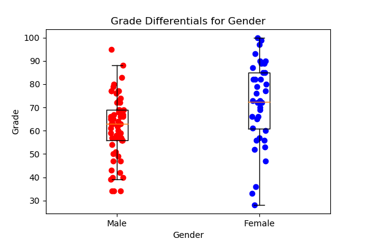

# Exploratory Data Analysis using Matlplotlib
Author: Arpit Rana

---
## Introduction
* The data explore d is Gender-Grade dataset.
- * Dataset Source: ICDS workshop

## Explanation of the Code
* The code begins by importing necessary Python packages:

```
import pandas as pd
import numpy as np
import random
from matplotlib import pyplot as plt
```

- *NOTE: If a package does not come pre-installed with Anaconda, you''ll need to install it using either pip install "package_name" or conda install "package_name"

We then import data from the data file. We print the data to allow us to verify what we've imported:

```
df=pd.read_csv("data/course_data.csv")
df.head()
```
We convert the pandas data frame into a list for male and females using the following line of code

```
xnames = ['Male','Female']
male_df = df[["Grade"]][df["Gender"]=="Male"]
female_df =df[["Grade"]][df["Gender"]=="Female"]

```
We use the .values function for pandas dataframe to convert the values into a list
```
male_list=male_df["Grade"].values
female_list=female_df["Grade"].values

male=np.array(male_list)
female=np.array(female_list)

# Jitered x-ccords for data point overlay
eps = 0.05 #controls amount of jitter
xm = [random.uniform(1-eps,1+eps) for i in range(0,60)]
xf = [random.uniform(2-eps,2+eps) for i in range(0,40)]
```
Visualizing the data as a Box-plot
```
# Box plot data is a list of lists
box_data = [male,female]


# Box-and-Whisker Pipeline
plt.plot(xm,male,'ro')
plt.plot(xf,female,'bo')
plt.boxplot(box_data,labels=xnames,sym="") #dont show outliers
plt.title("Grade Differentials for Gender")
plt.xlabel("Gender")
plt.ylabel("Grade")
plt.savefig('Box_whisker.png',dpi =100)
plt.show() # render pipeline
plt.close()

````
The output from this code is shown below:


---

### How to Run the Code
1. Open the Jupyter Notebook
2. Run the Jupyter Notebook
