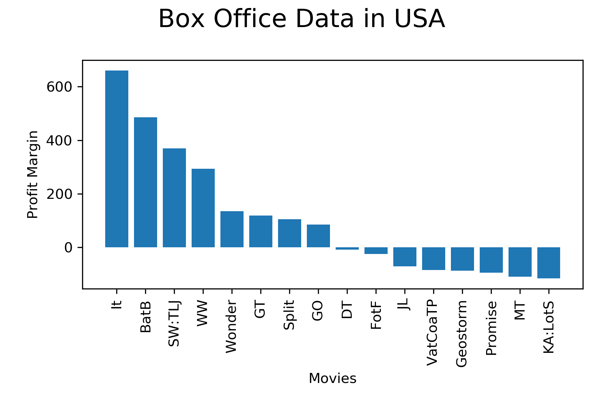

# Exploratory Data Analysis using Matlplotlib
Author: Arpit Rana

---
## Introduction
* The data explored 
- *Gender-Grade dataset. Dataset Source: ICDS Pythonworkshop
- *Box_Office Dataset. Dataset Source: ICDS Python workshop

## Explanation of the Code Gender-Grade dataset(Box-Plot:Example)
* The code begins by importing necessary Python packages:

```
import pandas as pd
import numpy as np
import random
from matplotlib import pyplot as plt
```

- *NOTE: If a package does not come pre-installed with Anaconda, you''ll need to install it using either pip install "package_name" or conda install "package_name"

We then import data from the data file. We print the data to allow us to verify what we've imported:

```
df=pd.read_csv("data/course_data.csv")
df.head()
```
We convert the pandas data frame into a list for male and females using the following line of code

```
xnames = ['Male','Female']
male_df = df[["Grade"]][df["Gender"]=="Male"]
female_df =df[["Grade"]][df["Gender"]=="Female"]

```
We use the .values function for pandas dataframe to convert the values into a list
```
male_list=male_df["Grade"].values
female_list=female_df["Grade"].values

male=np.array(male_list)
female=np.array(female_list)

# Jitered x-ccords for data point overlay
eps = 0.05 #controls amount of jitter
xm = [random.uniform(1-eps,1+eps) for i in range(0,60)]
xf = [random.uniform(2-eps,2+eps) for i in range(0,40)]
```
Visualizing the data as a Box-plot
```
# Box plot data is a list of lists
box_data = [male,female]


# Box-and-Whisker Pipeline
plt.plot(xm,male,'ro')
plt.plot(xf,female,'bo')
plt.boxplot(box_data,labels=xnames,sym="") #dont show outliers
plt.title("Grade Differentials for Gender")
plt.xlabel("Gender")
plt.ylabel("Grade")
plt.savefig('Box_whisker.png',dpi =100)
plt.show() # render pipeline
plt.close()

````
The output from this code is shown below:


---

## Explanation of the Code Gender-Grade dataset(Box-Plot:Example)
* The code begins by importing necessary Python packages:

```
import pandas as pd
import numpy as np
from matplotlib import pyplot as plt
```

- *NOTE: If a package does not come pre-installed with Anaconda, you''ll need to install it using either pip install "package_name" or conda install "package_name"

We then import data from the data file. We print the data to allow us to verify what we've imported:

```
df=pd.read_csv("data/box_office_data.csv")
df.head()
```
We add another column the pandas data frame for profit margin using the following line of code

```
# Add a new column to Pandas Dataframe
df['Profit']=np.nan

# Evaluate the Profit Margin for each Movie

revenues=df["REVENUE(Million_USD)"].values
revenues
costs=df["COSTS(Million_USD)"].values
costs

profits=revenues-costs
profits

df["Profit"]=profits
df.head()

```
We sort the dataframe on Profit margin in an ascending order and use list comprhension to arange our data for visualization
```
# sort data by counts and separate into lists
sorted_df= df.sort_values(by=["Profit"], ascending=False)
sorted_df

names_list  = sorted_df["ID"].values
values_list = sorted_df["Profit"].values
names=[i for i in names_list]
values=[i for i in values_list]
name_codes=[i for i in range(0,len(names))]

sorted_df
```
Pipe-Line for Visualizing the data as a Bar-Plot
```
#map codes to labels, and rotate the text
plt.bar(name_codes, values, align='center')
plt.xticks(name_codes,names,rotation=90)
plt.suptitle("Box Office Data in USA", fontsize = 18)
plt.xlabel("Movies")
plt.ylabel("Profit Margin")
plt.tight_layout()
plt.subplots_adjust(top=0.85)
plt.savefig('barplot.png',dpi=300)
plt.show()
plt.close()

````
The output from this code is shown below:


---


### How to Run the Code
1. Open the Jupyter Notebook
2. Run the Jupyter Notebook
